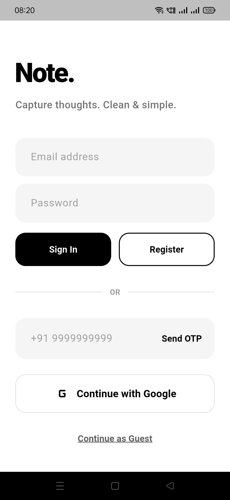
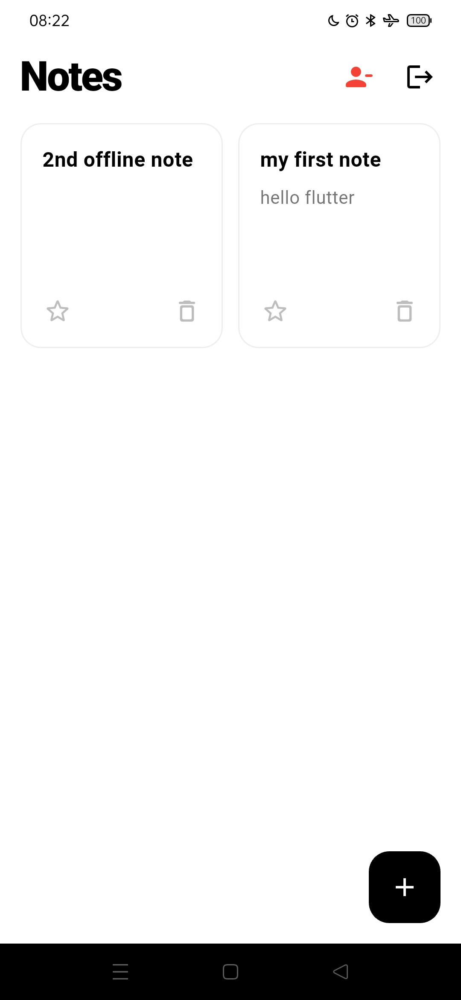
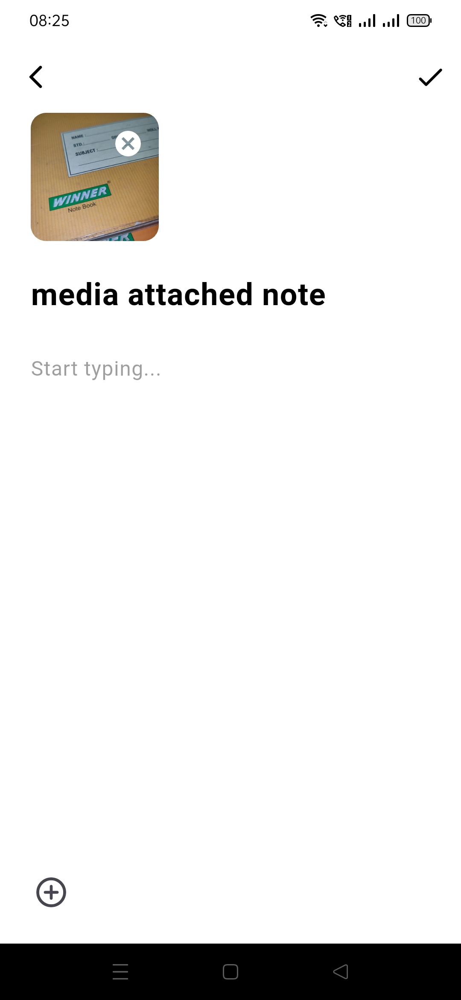
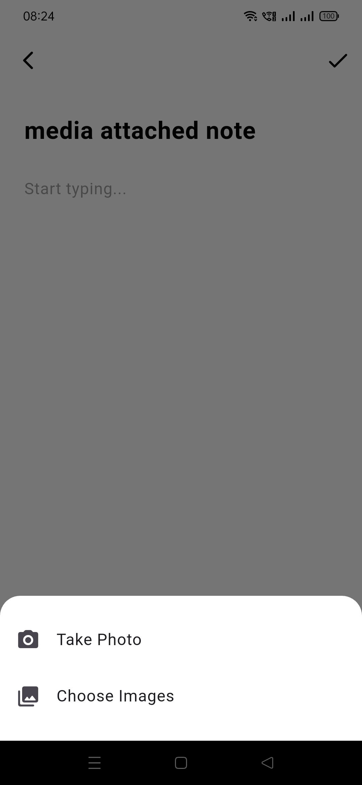
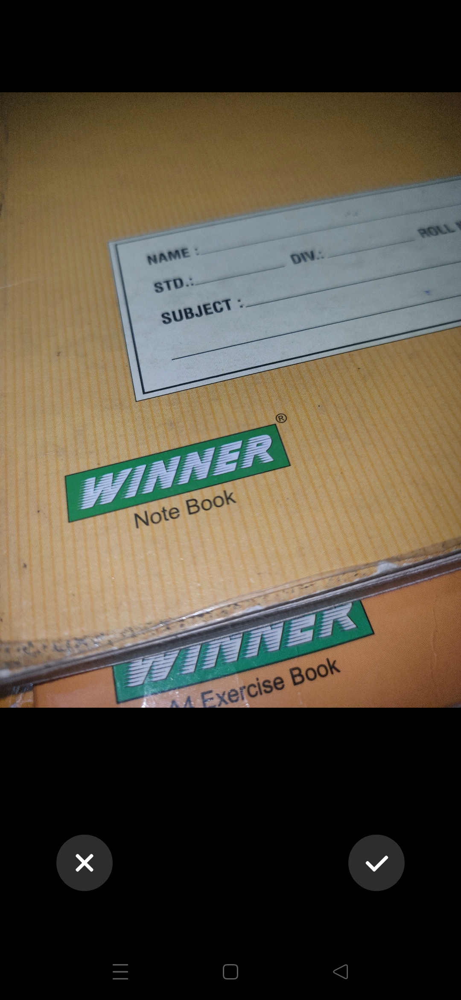
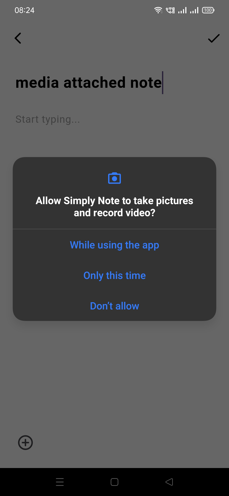
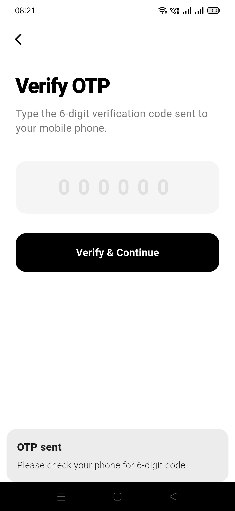
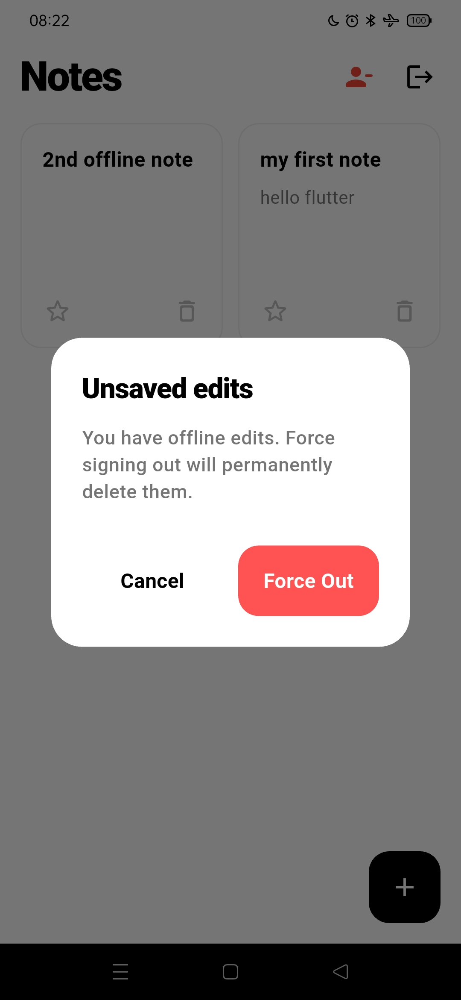

# Simply Note

A Flutter notes application built to practice and implement real-world mobile application architecture, authentication, cloud data persistence, local storage, and media handling.

The project uses **GetX, Firebase Authentication, Cloud Firestore, GetStorage, Supabase Storage, and Clean Architecture**.

## 📸 Screenshots

| Authentication & Home | Notes Workspace |
| --- | --- |
|  |  |

| Creating/Editing Notes | Image Selection Options |
| --- | --- |
|  |  |

| Capturing Imagery | Permission Guardrails |
| --- | --- |
|  |  |

| Interactive Verification | Unsaved Progress Warning |
| --- | --- |
|  |  |

## 📱 Overview

**Simply Note** is a personal notes application where users can authenticate, create and manage notes, and attach images to their notes.

The project was developed as a practical Flutter application to understand how different application layers and services work together rather than keeping all application logic directly inside the UI.

## ✨ Features

* User registration and authentication
* Email/password authentication
* Google Sign-In
* Create notes
* Edit notes
* Delete notes
* Mark notes as starred
* Store notes in Cloud Firestore
* Local persistence using GetStorage
* Firestore offline persistence
* Select images using camera/gallery
* Store note-related media using Supabase Storage
* Display remote images with caching
* Full-screen image viewing
* Reactive state management with GetX
* Dependency injection using GetX
* GetX Bindings and route management
* Repository-based architecture
* Feature-oriented project structure

## 🛠️ Tech Stack

| Technology / Package    | Purpose                                                         |
| ----------------------- | --------------------------------------------------------------- |
| Flutter                 | Application development                                         |
| Dart                    | Programming language                                            |
| GetX                    | State management, dependency injection, bindings and navigation |
| Firebase Authentication | User authentication                                             |
| Google Sign-In          | Google authentication                                           |
| Cloud Firestore         | Cloud database for notes                                        |
| GetStorage              | Local key-value persistence                                     |
| Supabase Storage        | Media/image storage                                             |
| Image Picker            | Camera/gallery image selection                                  |
| Cached Network Image    | Efficient remote image display                                  |
| Easy Image Viewer       | Full-screen image viewing                                       |
| UUID                    | Unique identifiers                                              |
| Clean Architecture      | Separation of responsibilities                                  |
| Git & GitHub            | Version control                                                 |

## 🏗️ Architecture

The application follows a **Clean Architecture / repository-based approach**.

The main responsibility is divided between:

```text
Presentation
     ↓
Domain
     ↓
Data
     ↓
External Services
```

The repository abstraction keeps the domain layer independent from the concrete storage implementation.

For example, the application can define a note repository contract in the domain layer while the data layer provides concrete implementations for different storage mechanisms.

```text
UI
 ↓
GetX Controller
 ↓
Use Case
 ↓
Note Repository
 ↓
Repository Implementation
 ↓
Storage / Backend
```

This approach helps separate UI logic, application/business logic, and data-access logic.

## 🗂️ Storage Architecture

The application works with multiple forms of persistence.

### GetStorage

GetStorage is used for local key-value persistence.

It was used during the earlier local-storage implementation of the notes feature and provides a lightweight local storage mechanism.

### Cloud Firestore

Cloud Firestore is used as the primary cloud database for storing notes.

The application also configures Firestore persistence so previously fetched data can remain available through Firestore's local cache.

### Supabase Storage

Supabase Storage is used for storing note-related media/images.

The application therefore separates:

```text
Note data
   ↓
Cloud Firestore

Image / media
   ↓
Supabase Storage
```

## 🔐 Authentication

Firebase Authentication is used to manage user authentication.

The application supports:

* Email/password authentication
* Google Sign-In

Authentication allows the application to associate notes with authenticated users and control access to user-specific data.

The general flow is:

```text
User
 ↓
Authentication UI
 ↓
Firebase Authentication
 ↓
Authenticated User
 ↓
Application
```

## 🔥 Firebase & Firestore

Cloud Firestore is used to persist notes in the cloud.

Typical note operations include:

```text
Create
   ↓
Firestore

Read
   ↓
Firestore

Update
   ↓
Firestore

Delete
   ↓
Firestore
```

Firestore security rules are also used to control access to stored data.

The project was built to understand the difference between:

* Authentication
* Database storage
* Local persistence
* Offline caching
* Security rules

rather than treating Firebase as a single all-in-one service.

## 🖼️ Image Handling

The application supports selecting images through the device.

The image flow is:

```text
Camera / Gallery
       ↓
   Image Picker
       ↓
   Selected Image
       ↓
 Supabase Storage
       ↓
  Remote Image URL
       ↓
 Cloud Firestore
```

The application can then retrieve and display the remote image when displaying the corresponding note.

`cached_network_image` is used for displaying network images efficiently, while `easy_image_viewer` is used for full-screen image viewing.

## 🔄 GetX

GetX is used throughout the application for:

* Reactive state management
* Dependency injection
* Controller lifecycle management
* Route management
* Route bindings
* Navigation

The application uses `GetMaterialApp` and GetX bindings to manage dependencies and controllers.

The general structure is:

```text
Route
 ↓
Binding
 ↓
Controller / Dependencies
 ↓
View
```

This keeps dependency registration separate from the UI widgets.

## 🧭 Navigation

Application navigation is handled using GetX routing.

Routes and page configurations are centralized in the routing layer.

Feature-specific dependencies can be registered through GetX bindings when a route is created.

## 📂 Project Structure

The project follows a feature-oriented structure with separation between application-wide core functionality and feature-specific code.

A simplified representation is:

```text
lib/
├── core/
│   ├── bindings/
│   ├── routes/
│   └── ...
│
├── features/
│   └── notes/
│       ├── data/
│       ├── domain/
│       └── presentation/
│
└── main.dart
```

The exact structure may evolve as the project continues to be developed.

## 🧠 What I Learned

This project helped me understand and practice:

* Flutter application architecture
* Clean Architecture principles
* Repository abstraction
* GetX reactive state management
* GetX dependency injection
* GetX Bindings
* GetX navigation
* Controller lifecycle
* Firebase Authentication
* Email/password authentication
* Google Sign-In
* Cloud Firestore CRUD operations
* Firestore security rules
* Firestore offline persistence
* Local storage with GetStorage
* Image selection with Image Picker
* Cloud media storage with Supabase
* Network image caching
* Separation of data and presentation responsibilities

## 🚀 Getting Started

### Prerequisites

Make sure Flutter is installed and configured on your system.

### Installation

Clone the repository:

```bash
git clone https://github.com/atharva-solves/note_app.git
```

Navigate to the project:

```bash
cd note_app
```

Install dependencies:

```bash
flutter pub get
```

Run the application:

```bash
flutter run
```

### Firebase Configuration

The application requires Firebase configuration for authentication and Firestore functionality.

When setting up the project locally, configure Firebase for the target platform using the appropriate Firebase project configuration.

## 📸 Screenshots

Screenshots can be added here to demonstrate the main application flows.

Recommended screenshots:

1. Login / authentication screen
2. Notes home screen
3. Create/edit note screen
4. Note with image
5. Firebase-backed notes
6. Full-screen image viewer

## 📌 Project Status

Simply Note is a Flutter learning and portfolio project developed to practice real-world application architecture, authentication, cloud data persistence, local storage, media handling, and state management.

The project may continue to receive improvements in UI, responsiveness, testing, and code quality as development continues.

## 👨‍💻 Author

**Atharva Shinde**

GitHub: `atharva-solves`

---

Built with Flutter and Dart.
